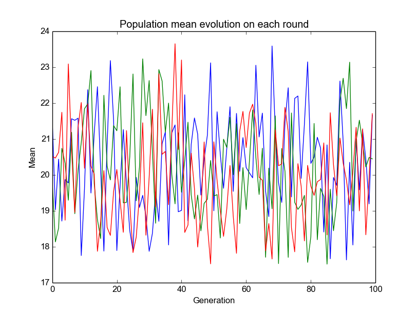
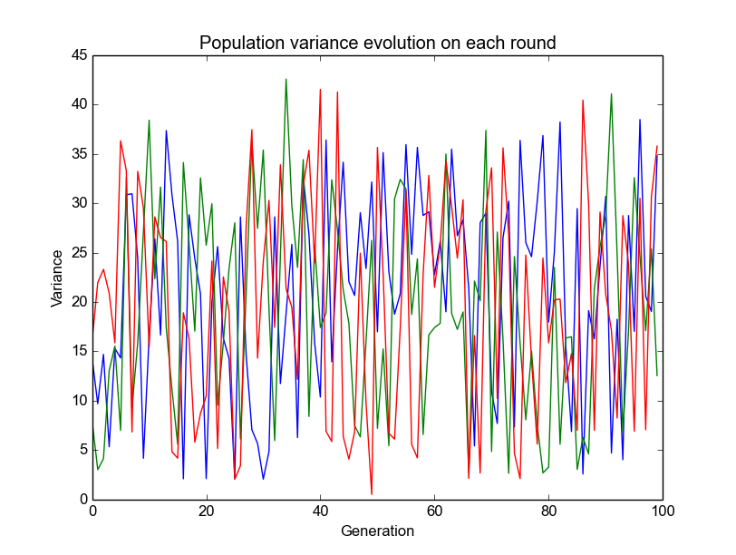
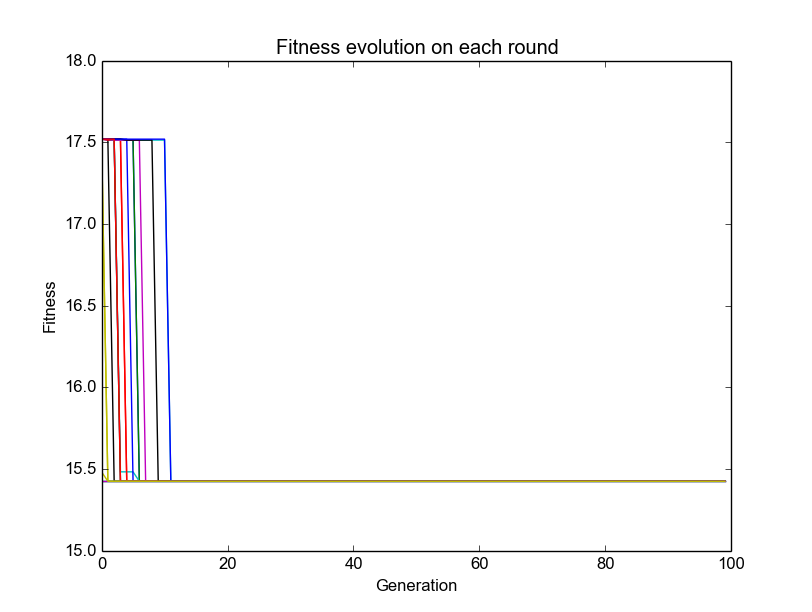
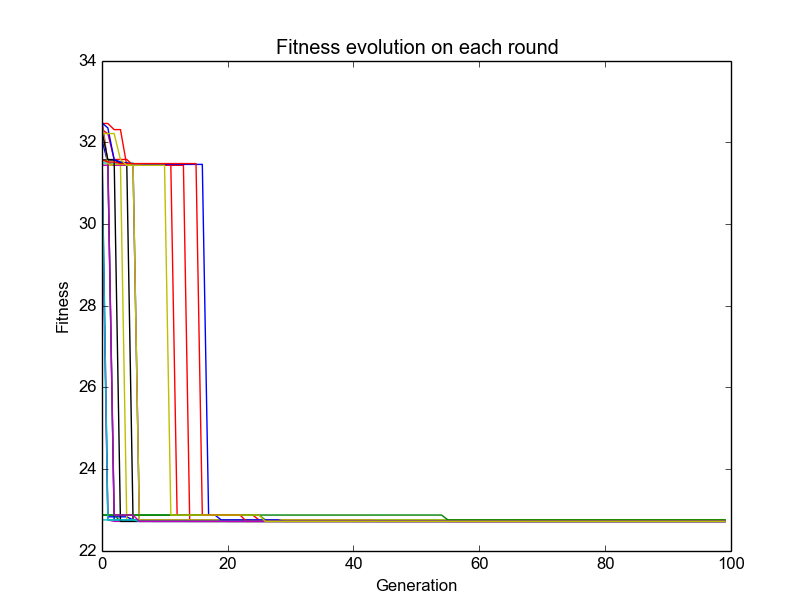
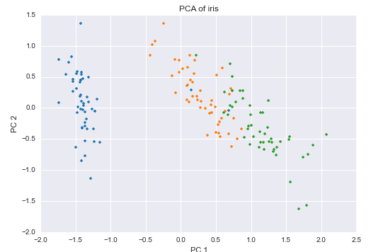
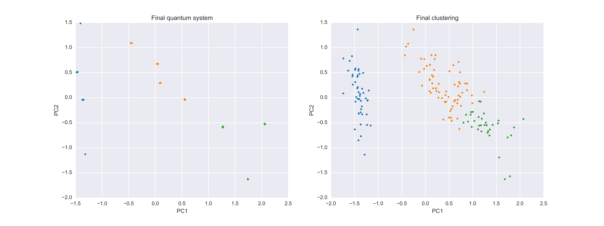
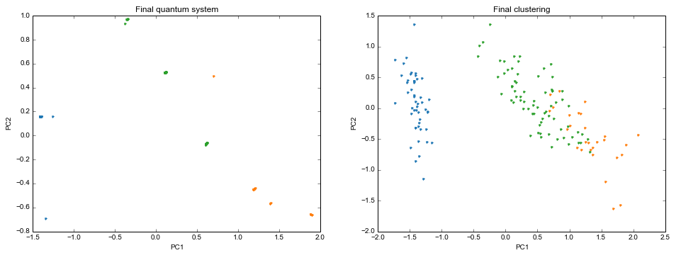
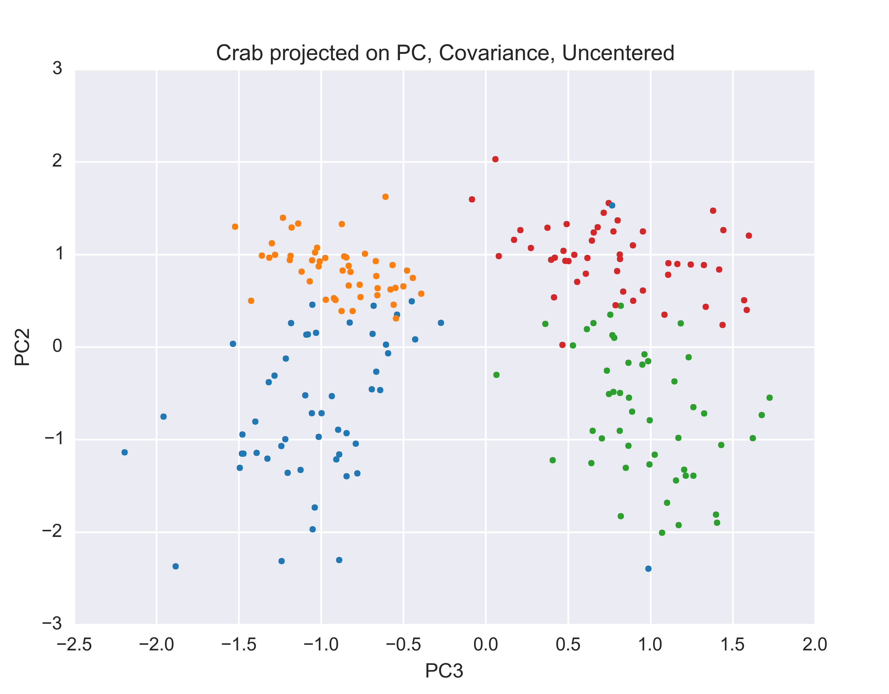

# Abbreviations

|ABRE|Description|
|----|-----------|
|QK-Means|Quantum K-Means
|qubit|Quantum bit
|PCA|Principal Component Analysis
|PC|Principal Component
|SVD|Singular Value Decomposition
|GPGPU|General-Purpose Computing on Graphics Processing Units

`[ TOC ]`

# Motivation

# Structure

The scope of the thesis is Big Data and Cluster Ensembles. A main requirement in this context is to have fast clustering techniques. This may be accomplished in two ways: algorithmically or with parallelization techniques. The former deals with finding faster solutions while the later takes existing solutions and optimizes them with execution speed in mind.

The initial research was under the algorithmic path. More specifically, exploring quantum clustering algorithms. The findings of this exploration were unproductive and turned the focus of the research to parallelization techniques. Two main paradigms of parallelization were found appropriate: GPU and distributed (among several machines). While the first is a readily available resource in common machines, the second is more able to address problems dealing with very large datasets.

# Quantum Clustering

There are two major paths for the problem of quantum clustering. The first is the quantization of clustering methods to work in quantum computers. This is basically converting algorithms to work partially or totally on a different computing paradigm, with support of quantum circuits or quantum computers computers. Literature suggests that quadratic (and even exponential in some cases) speedup may be achieved. Most of the approaches for such conversions make use of Groover's search algorithm, or a variant of it, e.g. [1]. Most literature on this path is also quite theoretical since quantum computers or quantum circuits are not easily available. This path can be seen as part of the bigger problem of quantum computing and quantum information processing.

<!--- #TODO get refs for not being feasable; Feynmann; I think washington course had something -->

An alternative to using real quantum systems would be to simulate them. However, simulating quantum systems is a very hard task by itself and literature suggest is not feasible. Given that the scope of the thesis is to accelerate clustering, having the extra overhead 

The second path is the computational intelligence approach, i.e.  to use quantum inspired algorithms that muster inspiration from quantum analogies. A study of the literature will reveal that this path typically further divides itself into two other branches. One comprehends the algorithms based on the concept of the quantum bit, the quantum analogue of a classical bit with interesting properties found in quantum objects. The other branch models data as a quantum system and uses the Schrödinger equation to evolve it.

[1] N. Wiebe, A. Kapoor, and K. Svore, “Quantum Algorithms for Nearest-Neighbor Methods for Supervised and Unsupervised Learning,” p. 31, 2014.

## Quantum bit

The quantum bit is a quantum object that has the properties of quantum superposition, entanglement and ...

<!--- taken from notebook -->

A qubit can have any value between 0 and 1 (superposition property) until it is observed, which is when the system collapses to either state. However, the probability with which the system collapses to either state  may be different. The superposition property or linear combination of states can be expressed as

$$
[\psi] = \alpha[0] + \beta[1]
$$

where $\psi$ is an arbitrary state vector and $\alpha$, $\beta$ are the the probability amplitude coefficients of basis states $[0]$ and $[1]$, respectevely. The basis states correspond to the spin of the modeled particle (in this case, a ferminion, e.g. electron). The coefficients are subjected to the following normalization:

$$|\alpha|^2 + |\beta|^2 = 1$$

where $|\alpha|^2$, $|\beta|^2$ are the probabilities of observing states $[0]$ and $[1]$, respectevely. $\alpha$ and $\beta$ are complex quantities and represent a qubit:

$$\begin{bmatrix}
\alpha \\
\beta
\end{bmatrix}$$

Moreover, a qubit string may be represented by:
$$
\begin{bmatrix}
\left.\begin{matrix}
\alpha_1\\ 
\beta_1
\end{matrix}\right| & \left.\begin{matrix}
\alpha_2\\ 
\beta_2
\end{matrix}\right| & \begin{matrix}
\alpha_3\\ 
\beta_3
\end{matrix}
\end{bmatrix}
$$

The probability of observing the state $[000]$ will be $|\alpha_1|^2 \times |\alpha_2|^2 \times |\alpha_3|^2$

To use this model for computing purposes, black-box objects called *oracles* are used.

<!--- end of notebook -->

<!--- #TODO get ref -->
[Def from wiki: In complexity theory and computability theory, an oracle machine is an abstract machine used to study decision problems. It can be visualized as a Turing machine with a black box, called an oracle, which is able to decide certain decision problems in a single operation. The problem can be of any complexity class. Even undecidable problems, like the halting problem, can be used.](http://en.wikipedia.org/wiki/Oracle_machine)

In this context, oracles contain strings of qubits and generate their own input by observing the state of the qubits. After collapsing, the qubit value becomes analogue to a classical bit.

<!--- #TODO get ref : see washington quantum computing classes -->
As it stands, oracles aren't quantum systems or even simulate them. The most appropriate description would be a probabilistic Turing machine.

Each string of qubits represents a number, so the number of qubits in each string will define its precision. The number of strings chosen for the oracles depends on the number of clusters and dimensionality of the problem (e.g. for 3 clusters of 2 dimensions, 6 strings will be used since 6 numbers are required). Each oracle will represent a possible solution.

## Quantum K-Means

Several clustering algorithms [4-6], as well as optimization problems [7], are modelled after this concept. To test the potential of the algorithms under this paradigm, a quantum variant of the K-Means algorithm based on [5] was chosen as a case study.

### Description of the algorithm

The Quantum K-Means (QK-Means) algorithm, as is described in [5], is based on the classical K-Means algorithm. It extends the basic K-Means with concepts from quantum mechanics (the qubit) and genetic algorithms.

<!--- (describe algorithm... - from notebook) -->

The algorithm has the following steps:
1. initialize population of oracles
2. Collapse oracles
3. K-Means
4. Compute cluster fitness
5. Store
6. Quantum Rotation Gate
7. Collapse oracles
8. Quantum cross-over and mutation
9. Repeat 3-7 until generation (iteration) limit is reached

The algorithm implemented and tested is a variant of the one described in [5]. The genetic operations of cross-over and mutation are both part of the genetic algorithms toolbox, but were not implemented due to the suggestion from [1]. This decision was based on the findings of [8], stating that the use of the angle-distance rotation method in the quantum rotation operation produces enough variability, with a careful choice of the rotation angle.

####  Initialize population of oracles
The oracles are created in this step and all qubit coefficients are initialized with $\frac{1}{\sqrt{2}}$, so that the system will observe either state with equal probability. This value is chosen taken into account the necessary normalization of the coefficients.

#### Collapse oracles
Collapsing the oracles implies making an observation of each qubit of each qubit string in each oracle. This is done by first choosing a coefficient to use (either can be used), e.g. $\alpha$. Then, a random value $r$ between 0 and 1 is generated. If $\alpha \ge r$ then the system collapses to $[0]$, otherwise to $[1]$.

#### K-Means
In this step we convert the binary representation of the qubit strings to base 10 and use them those values as initial centroids for K-Means. For each oracle, classical K-Means is then executed until it stabilizes or reaches the iteration limit. The solution centroids are returned to the oracles in binary representation.

#### Compute cluster fitness
Cluster fitness is computed using the Davies-Bouldin index for each oracle. The score of each oracle is stored in the oracle itself.

#### Store
The best scoring oracle is stored.

#### Quantum Rotation Gate
So far, we've had classical K-Means with a complex random number generation for the centroids and complicated data structures. This is the step that fundamentally differs from the classical version. In this step a quantum gate (in this case a rotation gate) is applied to all oracles except the best one. The basic idea is to shift the qubit coefficients of the least scoring oracles so they'll have a higher probability of collapsing into initial centroid values closer to the best solution so far. This way, in future generations, we'll not initiate with the best centroids so far (which will not converge further into a better solution) but we'll be closer while still ensuring diversity (which is also a desired property of the genetic computing paradigm). In conclusion, we want to look for better solutions than the one we got before in each oracle while moving in the direction of the best we found so far.

<!--- (end of notebook entry) -->

### Testing and Results
The testing was aimed at benchmarking both accuracy and speed. The input used was synthetic data, namely, Gaussian mixtures with variable cardinality and dimensionality. The results

(copy of report)

Regarding the Quantum K-Means (QK-Means), the tests were performed using 10 oracles, a qubit string length of 8 and 100 generations per round. The *classical* K-Means was executed using the *k-means++* centroid initialization method. Since QK-Means executes a classical K-Means for each oracle each generation, the number of initializations for K-Means was $num.oracles \times num.generations \times factor$, where $factor$ is an adjustable multiplier. Each test had 20 rounds.

All tests were done with 6 clusters (natural number of clusters). Two tests were done with the two dimensional dataset: one with a $factor=1.10$ (increase initializations by $10\%$) and another with $factor=1$. I'll call these tests T1 and T2, respectively. The test done with the six dimensional dataset (T3) used $factor=1.10$.

#### Timing results

<!--- table in csv format available in resource directory -->

Table 1: Timing results for the different algorithms in the different tests. Fitness time refers to the time that took to compute the DB index of each solution of classical K-Means. All time values are the average over 20 rounds and are displayed in seconds.

|Dataset|Algorithm|Mean|Variance|Best|Worst|
|-------|---------|----|--------|----|-----|
|T1| QK-Means          | 62.02642975 | 0.077065212 | 61.620424 | 62.579969 |
|bi36| K-Means           | 6.4774672   | 0.002501651 | 6.352554  | 6.585451  |
|| K-Means + fitness | 70.2238286  | 0.022223755 | 69.889105 | 70.548572 |
|| fitness           | 63.7463614  | 0.019722105 | 63.536551 | 63.963121 |
|T2| QK-Means          | 64.22347165 | 0.056559152 | 63.807367 | 64.807373 |
|bi36 noFactor K-Means| K-Means| 5.71167475  | 0.004903253 | 5.581391  | 5.877091  |
|| K-Means + fitness | 62.7021533  | 0.066919692 | 63.417207 | 62.180021 |
|| fitness           | 56.99047855 | 0.062016439 | 56.59863  | 57.540116 |
|T3| QK-Means          | 74.4917966  | 0.067688312 | 74.12105  | 74.976446 |
|sex36| K-Means           | 8.291648    | 0.007015777 | 8.160859  | 8.426203  |
|| K-Means + fitness | 72.36315915 | 0.05727269  | 71.856457 | 73.031841 |
|| fitness           | 64.07151115 | 0.050256913 | 63.695598 | 64.605638 |

The mean computation time of classical K-Means is an order of magnitude lower than that of QK-Means. However, in classical K-Means the solution typically chosen is the one with lowest sum of squared euclidean distances of points to their attributed centroid. To make a fair comparison between the two algorithms, the Davies-Bouldin index of all classical K-Means solutions was computed and used as the criteria to choose the best solution. When this is done, we can see that the total time of classical K-Means is actually higher that that of QK-Means in T1 and T3, but this is only due to the 1.10 multiplier on the number of initializations. In T2, possibly the fairest comparison, the computation times become very similar with only a 2\% difference between the two algorithms.

#### Accuracy
##### Comparing K-Means and QK-Means

<!--- table in csv format available in resource directory -->

Table 2: All values displayed are the average over 20 rounds, except for the Overall best which shows the best result in any round. The values represent the Davies-Bouldin fitness index (low is better).

| Dataset | Algorithm | Best        | Worst       | Mean        | Variance    | Overall best |
|---------|-----------|-------------|-------------|-------------|-------------|--------------|
| T1      | QK-Means  | 15.42531927 | 32.29577426 | 19.94704511 | 21.23544567 | 15.42531927  |
|         | K-Means   | 15.42531927 | 25.44913817 | 16.25013365 | 1.216919278 | 15.42531927  |
| T3      | QK-Means  | 22.72836641 | 65.19984617 | 36.10699242 | 78.14043743 | 22.71934191  |
|         | K-Means   | 22.71934191 | 46.72231967 | 26.18440481 | 22.96730826 | 22.71934191  |

The most relevant result in the table above is the mean of the best index. The value is the average over all rounds of the best solution in each round and it provides insight on the average performance of the algorithm. The results suggest that both algorithms perform equally well. The best overall result of each algorithm in all rounds is exactly the same. In T3, the mean performance of classical K-Means is marginally better.

I speculate that if classical K-Means was using only the sum of euclidean distances and not the DB index, the average performance would be worse. As it stands, choosing to use DB index with classical K-Means possibly represents a tradeoff between speed and accuracy.

##### QK-Means details

Here we’ll analyse a bit what’s happening within each QK-Means execution. One
would expect for the population’s fitness variance to decrease over the generations, as the probabilities for previous known solutions increase. The convergence of the population mean would also be expected to decrease for the same reason. However, experimental (Fig. 2 and 3) results don’t suggest any of these expectations (the results of T1 and T3 suggest the same). This may be due to low number of generations or simply because the random generation of initial centroids isn’t influenced enough by the qubit probabilities.

Analysing the evolution of the DB index of the best solution over the generations (Fig. 4 and 5) gives some insight on the rate of convergence. In both tests it is clear that the best solution is often reached in a quarter of the total generations. More detail can be seen in the following table.

<!--- table in csv format available in resource directory -->

Table 3: The values represent generations.

| Test | Mean  | Variance | Best | Worst |
|------|-------|----------|------|-------|
| T1   | 17.25 | 70.2875  | 3    | 33    |
| T3   | 28.05 | 568.6475 | 2    | 90    |

Figure 2: DB index mean of the population in T2. Only 4 rounds represented.

Figure 3: Figure 3: DB index variance of the population in T2. Only 4 rounds represented.

Figure 4: DB index of best solution in T2.

Figure 5: DB index of best solution in T3.

## Wave equation

The other approach to clustering mustering inspirations form quantum mechanical concepts is to use the Schrödinger equation. The algorithm under study was created by Horn and Gottlieb (<!--- #TODO add ref -->).

### Horn and Gottlieb's algorithm

The first step in this methodology is to compute a probability density function of the input data. This is done with a Parzen-window estimator in [2,3]. This function will be the wave function in the Schrödinger equation. Having this information we'll compute the potential function that corresponds to the state of minimum energy (ground state = eigenstate with minimum eigenvalue) [2].

This potential function is akin to the inverse of a probability density function. Minima of the potential correspond to intervals in space where points are together. So minima will naturally correspond to cluster centres [2]. The potential of every point in space is a costly computation. One method to address this problem is to compute the potential on the input data and converge this points toward some minima of the potential function. This is done with the gradient descent method in [2]. Another method [3] is to think of the input data as particles and use the Hamiltonian operator to evolve the quantum system in the time-dependant Schrödinger equation. Given enough time steps, the particles will converge to and oscillate around potential minima.

Both methods take as input parameter the variance $\sigma$ of the parzen-window estimator.

<!--- (from notebook Horn accuracy) -->
This method starts off by creating a Parzen-window density estimation of the input data by associating a Gaussian with each point, such that

$$ \psi (\mathbf{x}) = \sum ^N _{i=1} e^{- \frac{\left \| \mathbf{x}-\mathbf{x}_i \right \| ^2}{2 \sigma ^2}} $$

where $N$ is the total number of points in the dataset, $\sigma$ is the variance and $\psi$ is the probability density estimation. $\psi$ is chosen to be the wave function in Schrödinger's equation. The details of why this is are better described in [1-4]. Schrödinger's equation is solved in order of the potential function $V(x)$, whose minima will be the centres of the clusters of our data:      

$$
V(\mathbf{x}) = E + \frac {\frac{\sigma^2}{2}\nabla^2 \psi }{\psi} 
= E - \frac{d}{2} + \frac {1}{2 \sigma^2 \psi} \sum ^N _{i=1} \left \| \mathbf{x}-\mathbf{x}_i \right \| ^2 e^{- \frac{\left \| \mathbf{x}-\mathbf{x}_i \right \| ^2}{2 \sigma ^2}}
$$

And since the energy should be chosen such that $\psi$ is the groundstate (i.e. eigenstate corresponding to minimum eigenvalue) of the Hamiltonian operator associated with Schrödinger's equation (not represented above), the following is true

$$
E = - min \frac {\frac{\sigma^2}{2}\nabla^2 \psi }{\psi}
$$

With all of this, $V(x)$ can be computed. However, it's very computationally intensive to compute V(x) to the whole space, so we only compute the value of this function close to the data points. This should not be problematic since clusters' centres are generally close to the data points themselves. Even so, the minima may not lie on the data points themselves, so what we do is compute the potential at all data points and then apply the gradient descent method to move them to regions in space with lower potential.

There is another method to evolve the system other then by gradient descent which is explained in [4]. Together, this methods make the Dynamic Quantum Clustering algorithm <!--- #TODO add ref -->.
<!--- (continue) -->

<!--- #TODO describe the fine cluster algorithm; critique how this is done; what was developed; what  -->

### Testing and Results

<!--- 
#TODO
Put in accuracy results for crab,iris and gaussian mixtures  
Put in timing results
-->

The accuracy of this algorithm was tested with real world datasets, namely, the crab and iris datasets available at the UCI Machine Learning Repository.

<!--- #TODO add ref for repository -->

#### Iris data

The iris dataset ([available at the UCI ML repository](http://archive.ics.uci.edu/ml/datasets/Iris)) has 3 classes each with 50 data points. There are 4 features. The data is preprocessed using Principal Component Analysis (PCA). The natural clustering can be observed in Fig. I1. 

<!--- #TODO saved image from ipython -->

Fig. I1 - Plot of the two first principal components (PC).

I chose $\sigma=\frac{1}{4}$ to reproduce the experiments in [3]. Only the first two PC are used here, which account for $95.8\%$ of the energy. The clustering results can be seen in Fig. I2 and have an accuracy of 86% computed with consistency index.

Fig. I2 - Plots of the converged data data points and final clustering for 2 PC.

For the sake of completeness, I also clustered over all PCs. The clustering results can be seen in Fig. I3 and have an accuracy of 49.3% computed with consistency index.

Fig. I3 - Plots of the converged data data points and final clustering for all PC.

### Crab data

The crabs dataset has 200 samples and describes 5 morphological measurements on 50 crabs each of two colour forms and both sexes (total of 200 crabs), of the species _Leptograpsus variegatus_ collected at Fremantle, Western Australia. After a preprocessing using PCA with covariance matrix and uncentred data, the dataset is represented in Fig. C1 (projection over PC 2 and 3).<!--- #TODO add reference to dataset -->

Fig. C1 - Representation of the crab data projected over PC 2 and 3.

Initial work was aiming to reproduce results from [2], but lack of detail on the preprocessing used made it an harder task. Several preprocessings were used, namely whitening or not the data, centring it or not, using covariance versus correlation and different methods of computing the PCs through eigenvalue decomposition or Singular Value Decomposition (SVD). The closest representation to that of the [2] is the one if Fig. C1.

Covariance uncentred consistency index = 0.43
Covariance centred consistency index = 0.225

all pc covariance uncentred consistency index = 0.395
all dimensions original data consistency index = 0.25

## References

[1] N. Wiebe, A. Kapoor, and K. Svore, “Quantum Algorithms for Nearest-Neighbor Methods for Supervised and Unsupervised Learning,” p. 31, 2014.

[2] D. Horn and A. Gottlieb, “The Method of Quantum Clustering.,” NIPS, no. 1, 2001.
[3] M. Weinstein and D. Horn, “Dynamic quantum clustering: a method for visual exploration of structures in data,” Phys. Rev. E - Stat. Nonlinear, Soft Matter Phys., vol. 80, no. 6, pp. 1–15, Dec. 2009.

[4] E. Casper and C. Hung, “Quantum Modeled Clustering Algorithms for Image Segmentation,” vol. 2, no. March, pp. 1–21, 2013.
[5] E. Casper, C.-C. Hung, E. Jung, and M. Yang, “A Quantum-Modeled K-Means Clustering Algorithm for Multi-band Image Segmentation.” [Online]. Available: http://delivery.acm.org/10.1145/2410000/2401639/p158-casper.pdf?ip=193.136.132.10&id=2401639&acc=ACTIVE SERVICE&key=2E5699D25B4FE09E.F7A57B2C5B227641.4D4702B0C3E38B35.4D4702B0C3E38B35&CFID=476955365&CFTOKEN=55494231&__acm__=1423057410_0d77d9b5028cb3. [Accessed: 04-Feb-2015].
[6] J. Xiao, Y. Yan, J. Zhang, and Y. Tang, “A quantum-inspired genetic algorithm for k-means clustering,” Expert Syst. Appl., vol. 37, pp. 4966–4973, 2010.

[7] H. Wang, J. Liu, J. Zhi, and C. Fu, “The Improvement of Quantum Genetic Algorithm and Its Application on Function Optimization,” vol. 2013, no. 1, 2013.

[8] W. Liu, H. Chen, Q. Yan, Z. Liu, J. Xu, and Y. Zheng, “A novel quantum-inspired evolutionary algorithm based on variable angle-distance rotation,” 2010 IEEE World Congr. Comput. Intell. WCCI 2010 - 2010 IEEE Congr. Evol. Comput. CEC 2010, 2010.

# Parallel computing - GPGPU
The second direction of the work was given to parallel computing, more spefically to General-Purpose Computation on Graphics Processing Units (GPGPU). 

## Short Survey of available GPGPU frameworks

## Comparison and choice
It basically boils down to OpenCL vs CUDA. OpenCL has the advantage of portability with the issues of performance portability and harder to program. CUDA is easy to program, performs really good since it was designed alongside with the hardware itself but only works on NVIDIA devices.

## Overview of CUDA

# EAC for Big Data
Short intro of what EAC is all about, the direction taken (GPU for acceleration), the challenges of big data, ...
# overview of EAC

## Partition generation
This is the part 

